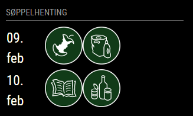

# MMM-HRS-PickupPlan

This is an extention module for the [MagicMirror²](https://github.com/MichMich/MagicMirror/). It will display the garbage collection dates for the Norwegian municipalities of Harstad, Narvik, Evenes, Gratangen, Ibestad, Kvæfjord, Lavangen and Tjeldsund.




## Installing:

Go to your `modules` directory *~/MagicMirror/modules* and type:

`git clone https://github.com/maan75/MMM-HRS-PickupPlan`

The module requires axios

`npm install axios`


## Using the module

To use this module, add the following configuration block to the modules array in the `config/config.js` file:
```js
var config = {
    modules: [
        {
            module: 'MMM-HRS-PickupPlan',
            position: "top_left",
            config: {
                kommunenr: 5413,
                gateadresse: "Emma Olsens vei 1"
                header : "Søppelhenting",
                antallHenteDager : 2,
                // See below for configurable options
            }
        }
    ]
}
```

## Configuration options

| Option             | Description
|------------------- |------------
| `kommunenr`        | *Required* Kommunenr; (5402, 1806, 1853, 5414, 5413, 5411, 5415 og 5412)
| `gateadresse`      | *Required* Gateadresse med husnummer.
| `header`           | *Optional* Overskrift, default er "HRS-PickupPlan"
| `antallHenteDager` | *Optional* Hvor mange datoer skal det vises hentetidspunkt for. Default 2
| `updateInterval`   | *Optional* Oppdateringsfrekvens  <br>**Type:** `int`(milliseconds) <br>Default 5 * 60 * 60 * 1000 (18000000ms = 5 timer)

